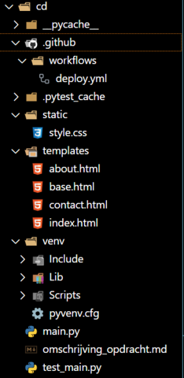
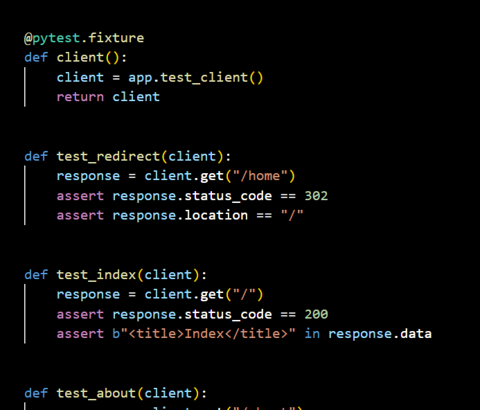

# aantekeningen

ssh root@146.190.28.250

vps opnieuw:
sudo shutdown -r now

cd /etc/nginx/sites-available/

## Venv

Slack met Christiaan:

Ik ben nu bezig met de eindopdracht om die automatische test pipeline op te zetten.
Dit is mijn folder structuur nu. Ik vroeg mij af of je de venv ook moet pushen naar Github dan.

**Christiaan Verlaan**
Nee die push je niet!
Veel te groot ook om dat te doen.

**Stijn**
Kan ik die beter weghalen dan?

**Christiaan Verlaan**
Je kunt het beste een nieuwe venv aanmaken op je server en daar je requirements op installeren
Je kunt hem overslaan in een .gitignore bestand

**Stijn**
Slim!

**Christiaan Verlaan**
Dan wordt hij nooit meegenomen :smile:

**Stijn**
Want die virtuele omgeving is voor handig om het te draaien op eigen computer toch?

**Christiaan Verlaan**
Het is zodat je zeker weet dat je applicatie werkt met de versies die daar op staan.
Een nieuwe versie van Flask zou er bijvoorbeeld voor kunnen zorgen dat je app niet meer werkt

**Stijn**
Oja dat was het!
Gaat opeens een lampje branden haha
Maar die kan je dus ook gewoon op je server installeren
Dat moet je dan op je server apart doen
Werken dit soort tests ook op de server?

**Christiaan Verlaan**
Jazeker, je kan pytest installeren en gebruiken. Maar ik zou je connectie laten testen door Github, hoeft je server in principe niet te doen denk ik.

**Stijn**
Hoe bedoel je dat precies, laten testen door Github

**Christiaan Verlaan**
Je maakt gewoon een nieuwe venv op je server in je project map, en daar installeer je flask en andere dingen
Je voert die tests uit met Github Actions

**Stijn**
Ja precies
Ja zodra je pusht zeg maar..

**Christiaan Verlaan**
Ja klopt

**Stijn**
Top
Laatste vraagje..
In de requirements..
Hoeft daar weer alleen pytest==7.3.1 in?
Zoals in die oefening github actions
Of moeten er in deze setting ook andere programma's bij

**Christiaan Verlaan**
Flask moet je ook hebben
Verder denk ik niks maar ligt er aan of je nog andere third party packages import in je app

**Stijn**
Ja precies
Maar geen gunicorn of dat soort dingen
Dat is allemaal op de server zelf
En Github doet te tests zeg maar vanaf mijn computer..
En als de test dan slaagt maakt hij contact met de server en zet de content op de vps
Begrijp ik het dan goed?

**Christiaan Verlaan**
Gunicorn is op je server inderdaad
Github maakt zijn eigen omgeving waar hij je requirements.txt installeert. En daar voert hij je tests uit.
Die omgeving is je GITHUB_WORKSPACE

**Stijn**
Nu valt het kwartje
Maar is het dan zo dat bij elke push, github echt weer al die dingen installeert?

**Christiaan Verlaan**
Ja dit workspace is eenmalig, er wordt dus elke keer een nieuwe ubuntu werkomgeving gemaakt

**Stijn**
Dat kost toch gigantisch veel ruimte voor github
Wow haha

**Christiaan Verlaan**
Nee joh die verwijderen ze gewoon weer

**Stijn**
ja zo
Maar nu snap ik waarom de actions vaak even duurt
Steeds eerst een nieuwe ubuntu omgeving maken haha

**Christiaan Verlaan**
Jaa hij zet een ubuntu omgeving op / installeert python / installeert requirements en dan pas komt je test file

**Stijn**
Ja precies
En daarom hoef je pip enzo niet in je requirements te zetten, omdat die standaard in Python zit toch?

**Christiaan Verlaan**
Oh en hij maakt ook nog een kopie van je repository haha
Precies

Klaar
